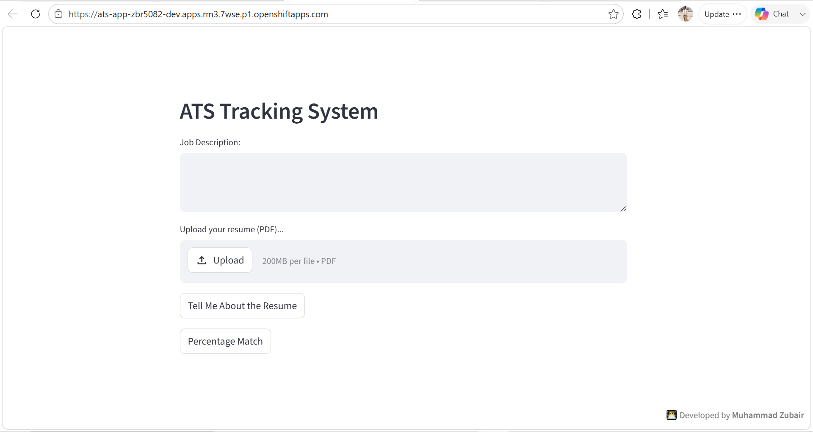

# 📄 ATS Resume Expert - AI Powered Resume Analyzer

**ATS Resume Expert** is a powerful, AI-driven Applicant Tracking System (ATS) built with Python and Streamlit. It leverages the latest **Google Gemini Flash** models to evaluate resumes (PDFs) against specific Job Descriptions, providing HR-level insights and ATS match percentages.

🌐 **Try it live (Render):** [https://ats-resume-expert-1.onrender.com](https://ats-resume-expert-1.onrender.com)

---

## 🚀 Features

- **👨‍💼 HR Manager Evaluation:** Get a professional review of the candidate's profile, highlighting strengths and weaknesses based on the job requirements.
- **📊 ATS Percentage Match:** Calculates the exact percentage match between the resume and the job description.
- **🔑 Keyword Analysis:** Identifies missing keywords that the candidate should add to improve their ATS score.
- **📄 PDF Processing:** Seamlessly converts uploaded PDF resumes into processable data using `pdf2image`.

---

## 🛠️ Tech Stack

- **Frontend:** [Streamlit](https://streamlit.io/)
- **AI Model:** [Google Generative AI (Gemini Flash Latest)](https://ai.google.dev/)
- **PDF Processing:** `pdf2image`, `Pillow`
- **Containerization:** Docker
- **Cloud Hosting:** Red Hat OpenShift, Render

---

## 🚢 Deployment Guide

This application is designed to be cloud-native and can be deployed to enterprise Kubernetes environments or standard cloud platforms.

### Option 1: Red Hat OpenShift (Enterprise Kubernetes)
This project includes a `Dockerfile` specifically configured for OpenShift environments, ensuring all system dependencies (like `poppler-utils` for PDF processing) are installed securely.

**Steps to deploy on OpenShift Developer Sandbox:**
1. Log in to the [Red Hat Developer Sandbox](https://developers.redhat.com/developer-sandbox).
2. Switch to the **Developer** perspective and click **+Add** -> **Import from Git**.
3. Paste this repository's URL.
4. OpenShift will automatically detect the `Dockerfile` and select the **BuildConfig** strategy.
5. Under **Advanced Options -> Target Port**, enter `8501` (Streamlit's default port).
6. Under **Deployment -> Environment Variables**, add your `GOOGLE_API_KEY`.
7. Click **Create**. OpenShift will automatically build the container image, deploy the Pods, and expose a secure Route URL!

### Option 2: Render (Web Service)
1. Connect your GitHub repository to Render.
2. Set the build command to `pip install -r requirements.txt`.
3. Set the start command to `streamlit run app.py`.
4. Add your `GOOGLE_API_KEY` in the Environment Variables tab.

---

## 💻 Local Installation & Setup

Before running this application locally, you must install **Poppler**, which is required by the `pdf2image` library to read PDF files.
- **Windows:** Download Poppler from [here](https://github.com/oschwartz10612/poppler-windows/releases/), extract it, and add the `bin` folder to your system's PATH.
- **Mac:** Run `brew install poppler`
- **Linux:** Run `sudo apt-get install poppler-utils`

**1. Clone the repository**
git clone https://github.com/Muhammad-Zubair796/ATS-Resume-Expert.git
cd ATS-Resume-Expert

**2. Create a Virtual Environment**
python -m venv .venv
# On Windows:
.venv\Scripts\activate
# On Mac/Linux:
source .venv/bin/activate

**3. Install Dependencies**
pip install -r requirements.txt

**4. Set up your Environment Variables**
Create a file named `.env` in the root directory of the project and add your Google Gemini API key:
GOOGLE_API_KEY="your_google_api_key_here"

**5. Run the Application**
streamlit run app.py

---

## 💡 How to Use

1. Open the application in your web browser.
2. Paste the target **Job Description** into the text area.
3. Upload the candidate's **Resume** in PDF format.
4. Click **"Tell Me About the Resume"** for a detailed HR evaluation.
5. Click **"Percentage Match"** to see the ATS score and missing keywords.

---

## 👨‍💻 Author

Developed by **Muhammad Zubair**
- GitHub: [@Muhammad-Zubair796](https://github.com/Muhammad-Zubair796)